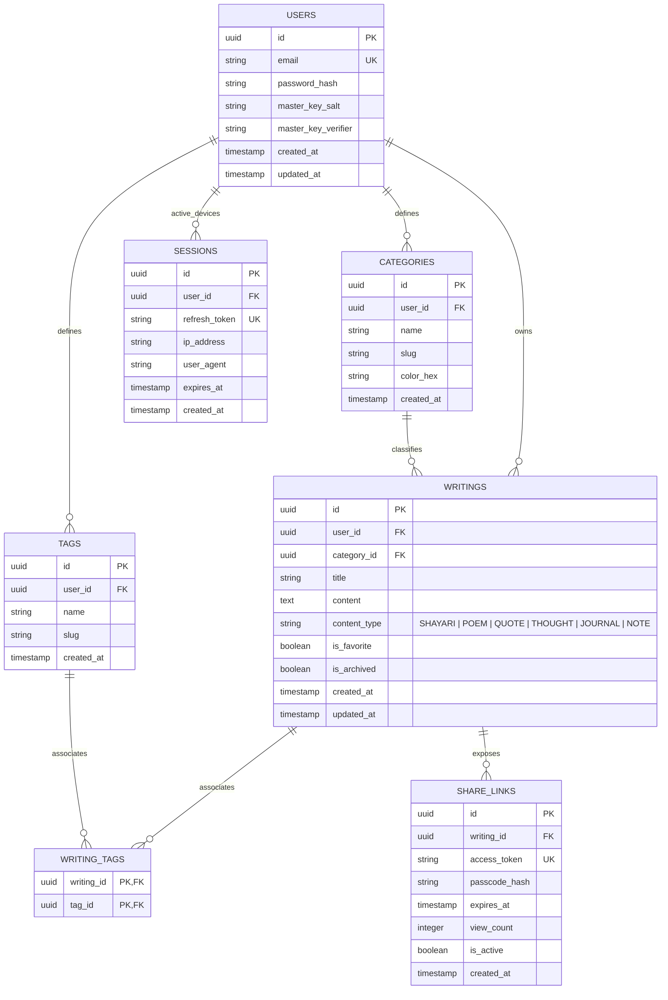
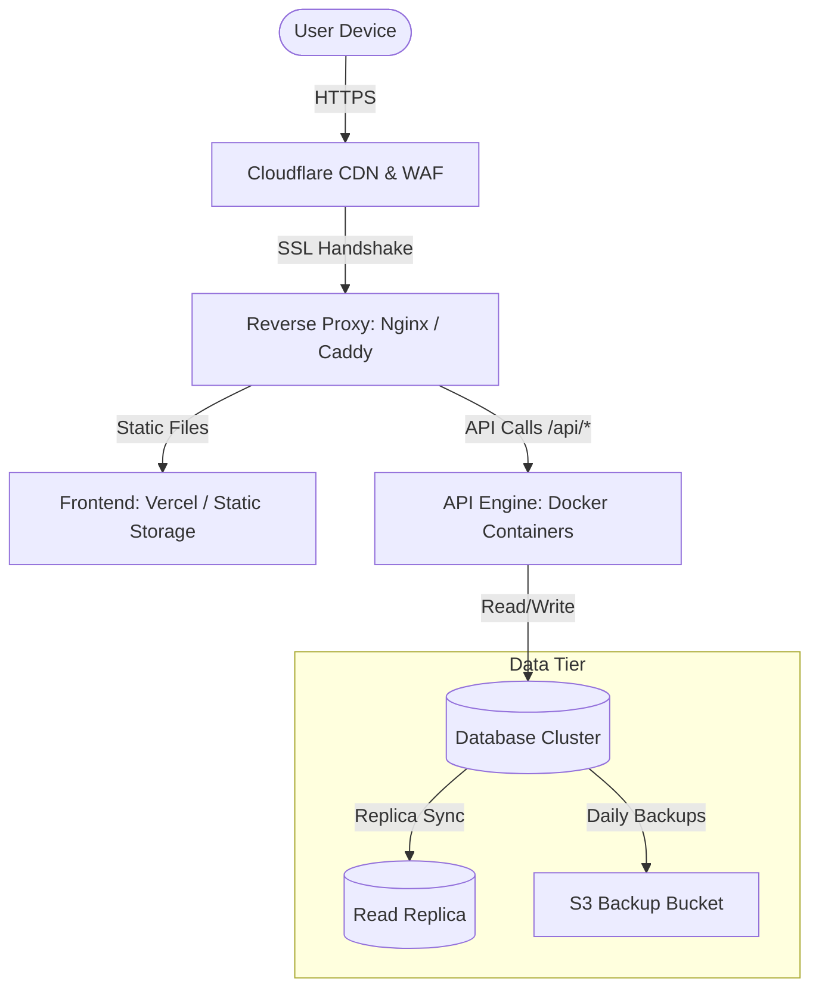

# System Architecture & Product Design: The Vault
**Version:** 1.0.0  
**Author:** Senior Software Architect & Product Designer  
**Date:** June 22, 2026  
**Status:** PROPOSED  

---

## 1. Product Requirements Document (PRD)

### 1.1 Product Overview
**The Vault** is a secure, personal-first digital sanctuary designed for writers, poets, and thinkers to store, organize, protect, and selectively share their writings (Shayaris, Poems, Quotes, Thoughts, Journals, and Notes). In an era dominated by public social feeds, *The Vault* prioritizes privacy, introspective writing, and aesthetic elegance.

### 1.2 Target Audience & Core Philosophy
*   **Target Audience:** Creative writers, hobbyist poets, journal keepers, and individuals seeking a private, distraction-free writing environment.
*   **Philosophy:** *Personal-First & Security-First.* The user owns their data. The interface must feel like a premium, physical leather-bound journal translated to a modern, fluid dark-themed digital application.

### 1.3 Scope & Non-Functional Requirements
*   **Usability:** Mobile-first responsive layout with custom micro-interactions, rich typography, and smooth transitions.
*   **Performance:** Search query responses in < 50ms (locally or server-side). Page load times under 1.5 seconds.
*   **Availability:** Offline-capable caching (PWA model) with localized database sync.
*   **Scalability:** Stateless API server architecture capable of transitioning from an embedded SQLite storage instance to an enterprise-grade PostgreSQL cluster with zero code modifications.

---

## 2. User Stories

### Epic 1: Authentication & Encryption
*   **US-1.1 (Register):** As a user, I want to register an account using my email and a strong password so that my private repository is isolated.
*   **US-1.2 (Security Lock):** As a user, I want to set a secondary PIN or biometric lock (WebAuthn/Passkey) to unlock the app quickly on my mobile device without entering my master password every time.

### Epic 2: Content Management & Writing Experience
*   **US-2.1 (Aesthetic Editor):** As a writer, I want a minimalist rich text editor with options for markdown shortcut inputs and distraction-free modes so I can write without cognitive clutter.
*   **US-2.2 (Categorization):** As a writer, I want to classify my writings into defined genres (Shayari, Poem, Quote, Thought, Journal, Note) and attach multiple tags so that I can filter them easily later.
*   **US-2.3 (Auto-save):** As a writer, I want my writing to auto-save locally every 5 seconds so that I never lose work due to network interruption.

### Epic 3: Search, Protection, & Utility
*   **US-3.1 (Omni-search):** As a user, I want a global search bar (accessible via `Ctrl+K`) that searches titles, content, categories, and tags simultaneously with fuzzy matching.
*   **US-3.2 (Export to PDF):** As a writer, I want to export my writing to a beautifully formatted PDF with custom font layouts so that I can print or publish them.
*   **US-3.3 (Secure Public Sharing):** As a writer, I want to generate a secure public link for a single entry, optionally setting an expiration date and passcode, so that I can share a specific poem without compromising my vault.

---

## 3. Feature List

| Feature ID | Feature Module | Technical Specification | Priority |
| :--- | :--- | :--- | :--- |
| **F-101** | **Multi-format Editor** | WYSIWYG editor (using TipTap or Lexical) with markdown support, word counter, and custom styling presets. | P0 |
| **F-102** | **Aesthetic Dark Theme** | Curated dark palette using deep zinc/gray hues, high contrast, typography hierarchy (Playfair Display for headings, Inter for interface). | P0 |
| **F-103** | **Fuzzy Omni-Search** | Client-side search library (e.g., Fuse.js) for offline entries, backed by DB full-text search indexes. | P0 |
| **F-104** | **Cryptographic Lock** | Server-side password hashing with Argon2id. Client-side database fields (like Journal contents) encrypted using AES-256-GCM. | P1 |
| **F-105** | **Secure Share Links** | Unique UUID v4 sharing URL with optional bcrypt-hashed access passcodes and automated expiry scheduler. | P1 |
| **F-106** | **PDF Layout Engine** | Client/Server-side PDF renderer (e.g., PDFKit or Puppeteer) applying CSS print styles matching classical book layouts. | P2 |
| **F-107** | **Offline Mode (PWA)** | Service workers caching assets and queuing sync transactions using IndexedDB. | P2 |

---

## 4. Database Design

To ensure a seamless migration path from **SQLite** to **PostgreSQL**, database-agnostic design principles are utilized:
1.  **UUIDs for Identifiers:** All table primary keys use UUID v4 strings (represented as `TEXT` in SQLite and `UUID` in PostgreSQL).
2.  **UTC Datetimes:** Timestamps are stored as standard ISO-8601 strings (SQLite) or `TIMESTAMPTZ` (PostgreSQL).
3.  **JSON Handling:** SQLite's JSON1 extension matches PostgreSQL's `JSONB` for storing flexible layout preferences.

### 4.1 Entity Relationship Diagram (ERD)



### 4.2 Portability Schema (SQL DDL Example)

#### SQLite Schema Definition
```sql
CREATE TABLE users (
    id TEXT PRIMARY KEY NOT NULL,
    email TEXT UNIQUE NOT NULL,
    password_hash TEXT NOT NULL,
    master_key_salt TEXT NOT NULL,
    master_key_verifier TEXT NOT NULL,
    created_at TEXT DEFAULT (datetime('now')),
    updated_at TEXT DEFAULT (datetime('now'))
);

CREATE TABLE writings (
    id TEXT PRIMARY KEY NOT NULL,
    user_id TEXT NOT NULL,
    category_id TEXT,
    title TEXT NOT NULL,
    content TEXT NOT NULL, -- Encrypted content
    content_type TEXT NOT NULL CHECK(content_type IN ('SHAYARI', 'POEM', 'QUOTE', 'THOUGHT', 'JOURNAL', 'NOTE')),
    is_favorite INTEGER DEFAULT 0 CHECK(is_favorite IN (0,1)),
    is_archived INTEGER DEFAULT 0 CHECK(is_archived IN (0,1)),
    created_at TEXT DEFAULT (datetime('now')),
    updated_at TEXT DEFAULT (datetime('now')),
    FOREIGN KEY(user_id) REFERENCES users(id) ON DELETE CASCADE,
    FOREIGN KEY(category_id) REFERENCES categories(id) ON DELETE SET NULL
);

CREATE INDEX idx_writings_user ON writings(user_id);
CREATE INDEX idx_writings_search ON writings(title, content);
```

#### PostgreSQL Migration Target Mapping
*   `TEXT PRIMARY KEY` $\rightarrow$ `UUID PRIMARY KEY DEFAULT gen_random_uuid()`
*   `TEXT DEFAULT (datetime('now'))` $\rightarrow$ `TIMESTAMPTZ DEFAULT CURRENT_TIMESTAMP`
*   `INTEGER DEFAULT 0 CHECK(...)` $\rightarrow$ `BOOLEAN DEFAULT FALSE`
*   Full Text Search index on writings changes from SQLite's FTS5 virtual table to PostgreSQL's `tsvector` and `GIN` indexes.

---

## 5. API Design (API-First RESTful)

All APIs accept and return JSON bodies. Headers must include Authorization token: `Bearer <jwt_token>`.

### 5.1 Authentication Endpoints
*   `POST /api/v1/auth/register` - Registers a new user. Returns user details and token keys.
*   `POST /api/v1/auth/login` - Validates credentials. Returns Access JWT and Refresh Token in an HttpOnly secure cookie.
*   `POST /api/v1/auth/refresh` - Generates a new Access JWT using the Refresh Token.

### 5.2 Writing Management Endpoints
*   `GET /api/v1/writings` - Query and filter writings (supports sorting, search query, category, tags, pagination).
*   `POST /api/v1/writings` - Create a new writing entry.
*   `GET /api/v1/writings/{id}` - Retrieve details of a specific writing.
*   `PUT /api/v1/writings/{id}` - Full update of a writing.
*   `PATCH /api/v1/writings/{id}` - Partial update (e.g., marking as favorite or archiving).
*   `DELETE /api/v1/writings/{id}` - Soft/Hard deletion of an entry.

### 5.3 Sharing & Utilities
*   `POST /api/v1/writings/{id}/share` - Generates a public shareable link.
    *   *Body Payload:*
        ```json
        {
          "has_passcode": true,
          "passcode": "SecretPoem123",
          "expires_in_hours": 48
        }
        ```
    *   *Success Response (201 Created):*
        ```json
        {
          "share_id": "8f3b9c7d-c231-4a4b-9d4f-3f623e1c2b5d",
          "share_url": "https://thevault.app/share/8f3b9c7d-c231-4a4b-9d4f-3f623e1c2b5d",
          "expires_at": "2026-06-24T19:00:00Z"
        }
        ```
*   `GET /api/v1/public/share/{share_id}` - Fetch public writing (checks passcode and expiration).
*   `GET /api/v1/writings/{id}/export` - Generates PDF binary of target writing.

---

## 6. Project Directory Structure
To facilitate a separation of concerns and scaling to multiple backend engineers, a Monorepo using **Clean Architecture** conventions is selected:

```
the-vault/
├── apps/
│   ├── web/                     # Next.js / React Frontend Application
│   │   ├── src/
│   │   │   ├── components/      # UI components (Editor, Sidebar, Dialogs)
│   │   │   ├── hooks/           # React hooks (useAuth, useWritings, useSync)
│   │   │   ├── lib/             # Utilities (crypto.ts, pdf.ts)
│   │   │   ├── pages/           # Routing layers
│   │   │   └── styles/          # Global CSS & Tailwind Tokens (if applicable)
│   │   └── package.json
│   └── api/                     # Node.js + Express / Fastify Server
│       ├── src/
│       │   ├── config/          # Environment variables & DB connection
│       │   ├── controllers/     # Route request handlers
│       │   ├── middleware/      # Auth, RateLimiting, ErrorHandler
│       │   ├── models/          # Database access layer (Prisma/Kysely schemas)
│       │   ├── services/        # Business logic (Encryption, PDF conversion)
│       │   └── index.ts         # Entry point
│       └── package.json
├── packages/                    # Shared configurations and schemas
│   ├── database/                # Database migrations & seeds
│   └── tsconfig/                # Core TypeScript config patterns
├── docker-compose.yml
└── README.md
```

---

## 7. Security Architecture

### 7.1 Zero-Knowledge / Encrypted Storage Model
To deliver on the "Personal-First" promise, sensitive fields (`writings.content` and `writings.title`) can be encrypted client-side using a symmetric key derived from the user's password. 
*   **Key Derivation Function (KDF):** PBKDF2 or Argon2id executing on the client device.
*   **Encryption Algorithm:** AES-256-GCM.
*   **Implication:** Even in the event of a total database leak, writing contents remain unreadable to any third-party, including the database administrator.

### 7.2 Core Security Requirements
1.  **Session Security:** 
    *   Access tokens are short-lived JWTs (15 minutes).
    *   Refresh tokens are stored in `HttpOnly`, `Secure`, `SameSite=Strict` cookies to prevent Cross-Site Scripting (XSS) extraction.
2.  **Rate Limiting:** IP-based and token-based rate limiting of 100 requests per 15 minutes per user.
3.  **Data Isolation:** Column/row level check constraints forcing `user_id` validation on all DB queries.
4.  **CORS & CSP Policy:** Strict Content Security Policy (CSP) blocking unauthorized script injections and framing attacks (X-Frame-Options: DENY).

---

## 8. Deployment Strategy & Lifecycle

### 8.1 Development Phases
*   **Phase 1: Foundation (Weeks 1-4):**
    *   Init Monorepo structure, Tailwind/CSS setup.
    *   SQLite database setup with Prisma.
    *   Register, Login, Session Management API.
*   **Phase 2: The Creative Vault (Weeks 5-8):**
    *   TipTap/Lexical editor styling & auto-save engine.
    *   Tags and Categories CRUD.
    *   Local fuzzy search module.
*   **Phase 3: Security & Export (Weeks 9-12):**
    *   Implementation of client-side encryption layers.
    *   PDFKit document generation.
    *   Public sharing generation with expiration clocks.
*   **Phase 4: Scaling & Launch (Weeks 13-16):**
    *   PostgreSQL database migration & scaling validation.
    *   CI/CD pipelines, Dockerization, and production deployment.

### 8.2 Deployment Blueprint



*   **Hosting:** Dockerized API instances running behind Caddy reverse-proxy. Frontend deployed to Vercel/Netlify or hosted as static assets on AWS S3/CloudFront.
*   **Database Management:**
    *   *SQLite (Initial):* Embedded SQLite database stored on a persistent volume with automated backups orchestrated via **Litestream** directly to AWS S3.
    *   *PostgreSQL (Scale-up):* Managed DB instance (e.g., Supabase, Neon, or AWS RDS) with read replicas and point-in-time recovery (PITR) enabled.

---

## 9. Future Product Roadmap

```
  ┌─────────────────────────────────────────────────────────────┐
  │  Q1 2026: Foundation Launch                                 │
  │  - Single writer app with SQLite & Local Search             │
  │  - PDF layouts, Standard encryption model                   │
  └──────────────────────────────┬──────────────────────────────┘
                                 │
                                 ▼
  ┌─────────────────────────────────────────────────────────────┐
  │  Q2 2026: Mobile Application (Capacitor/React Native)        │
  │  - Native iOS & Android shells wrapping the web interface    │
  │  - Biometric device-level unlocking (FaceID/TouchID)        │
  └──────────────────────────────┬──────────────────────────────┘
                                 │
                                 ▼
  ┌─────────────────────────────────────────────────────────────┐
  │  Q3 2026: Collaborative Salons & Portfolios                 │
  │  - Interactive read-only portfolios for poets               │
  │  - Commenting and critiques on curated public writing links │
  └─────────────────────────────────────────────────────────────┘
```
